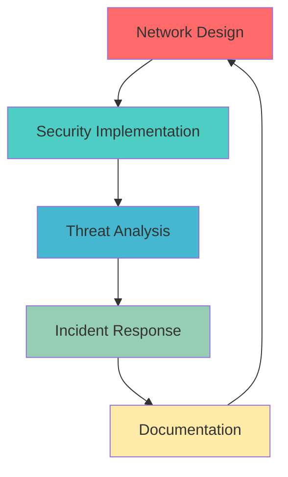

# 👋 Hello, I'm Azaldo!

<div align="center">
  
  
  
  [](https://www.linkedin.com/in/azaldo-mazibuko)
  [](https://github.com/AzaldoMAZ)
  [](mailto:azaldomazibuko65@gmail.com)
  
</div>

---

## 🚀 About Me

I'm a passionate **Network Engineer** and **Cybersecurity Enthusiast** dedicated to securing digital infrastructures and optimizing network performance. Currently pursuing advanced certifications and hands-on experience through various projects and internships.

💼 **Current Role**: Security Analyst  ( AICTE Oasis Infobyte Internship) <br>
🎯 **Focus Areas**: Network Security | Threat Analysis | Infrastructure Design  
📚 **Learning Path**: Advanced Cisco Technologies | Penetration Testing | Cloud Security  
🚀 **Mission**: Building secure, resilient network infrastructures

---

## 🛠️ Technical Arsenal

<div align="center">

### 🌐 **Networking & Security**


### 💻 **Programming Languages**


### 🎨 **Web Technologies**


### 🔧 **Tools & Platforms**


</div>

---

## 🎯 Core Competencies

<table>
<tr>
<td width="50%">

### 🔒 **Cybersecurity**
```yaml
Web Security:
  - Vulnerability Assessment
  - Security Auditing
  - Threat Detection
  
Network Security:
  - Firewall Configuration
  - Intrusion Detection
  - Security Monitoring
```

</td>
<td width="50%">

### 🌐 **Networking**
```yaml
Network Management:
  - Protocol Analysis
  - Performance Optimization
  - Infrastructure Design
  
Troubleshooting:
  - Network Diagnostics
  - Issue Resolution
  - Root Cause Analysis
```

</td>
</tr>
</table>

---

## 🚧 Current Projects & Experience

<div align="center">

### 📡 **Network Home Lab Project**
*Building comprehensive network topologies with Cisco Packet Tracer*
- **Scenarios**: DHCP, DNS, NAT, VLAN, STP, EIGRP, OSPF, ACLs
- **Deliverables**: Network diagrams, .pkt files, configuration commands
- **Focus**: Real-world network implementation and troubleshooting

### 🛡️ **OIBSIP Cybersecurity Internship**  
*Comprehensive cybersecurity project demonstrating practical security skills*
- **Incident Response Simulation**: Threat detection and mitigation
- **Security Analysis**: Vulnerability assessment and reporting
- **Documentation**: Professional security protocols and procedures

</div>



---

## 📊 GitHub Analytics

<div align="center">
  
  
</div>

<div align="center">
  
</div>

---

## 🎖️ Soft Skills & Leadership

<div align="center">

| 💬 **Communication** | 🤝 **Teamwork** | 🧩 **Problem-Solving** | 📚 **Documentation** |
|:---:|:---:|:---:|:---:|
| Clear technical explanations | Collaborative project work | Creative solution finding | Comprehensive project docs |
| Stakeholder presentations | Cross-functional teams | Root cause analysis | Knowledge sharing |

</div>

---

## 🌟 Featured Repository

<div align="center">

[](https://github.com/AzaldoMAZ/OIBSIP)

**🛡️ Comprehensive Cybersecurity Internship Project**  
*Demonstrating practical security skills through incident response simulation, threat analysis, and security documentation*

</div>

---

## 📈 Learning Journey

```ascii
🎯 Current Goals:
├── 🔐 Advanced Penetration Testing
├── ☁️  Cloud Security (AWS/Azure)
├── 🏆 Cisco CCNA Certification
└── 🛡️  Security+ Certification

📚 Next Learning Path:
├── Network Automation with Python
├── Advanced Threat Hunting
├── Kubernetes Security
└── DevSecOps Practices
```

---

## 🤝 Let's Connect!

<div align="center">

**Always open to discussing:**
- Network security challenges
- Collaboration opportunities  
- Industry best practices
- Career advice and mentorship

---

*"In cybersecurity, the only constant is change. Stay curious, stay secure!"* 🔐


</div>

---

<div align="center">
  
</div>
